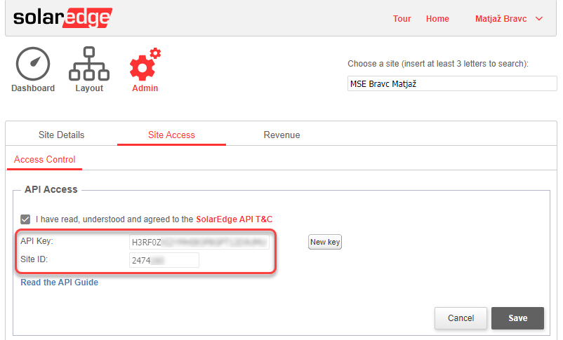
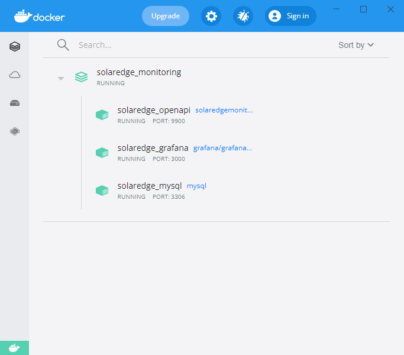
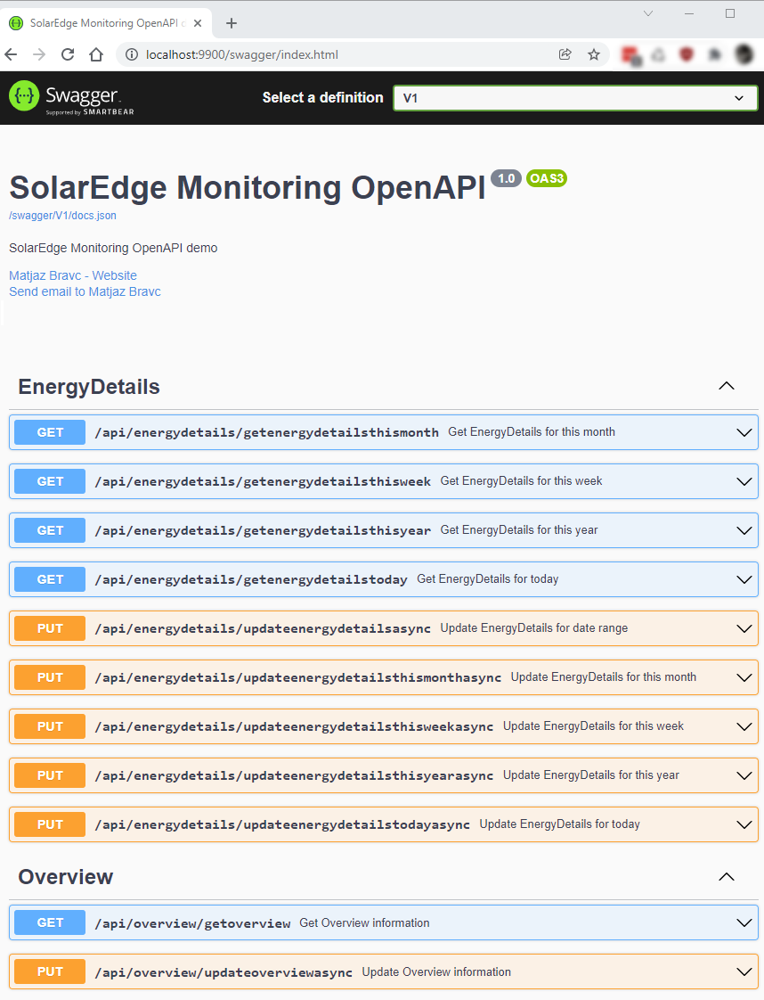
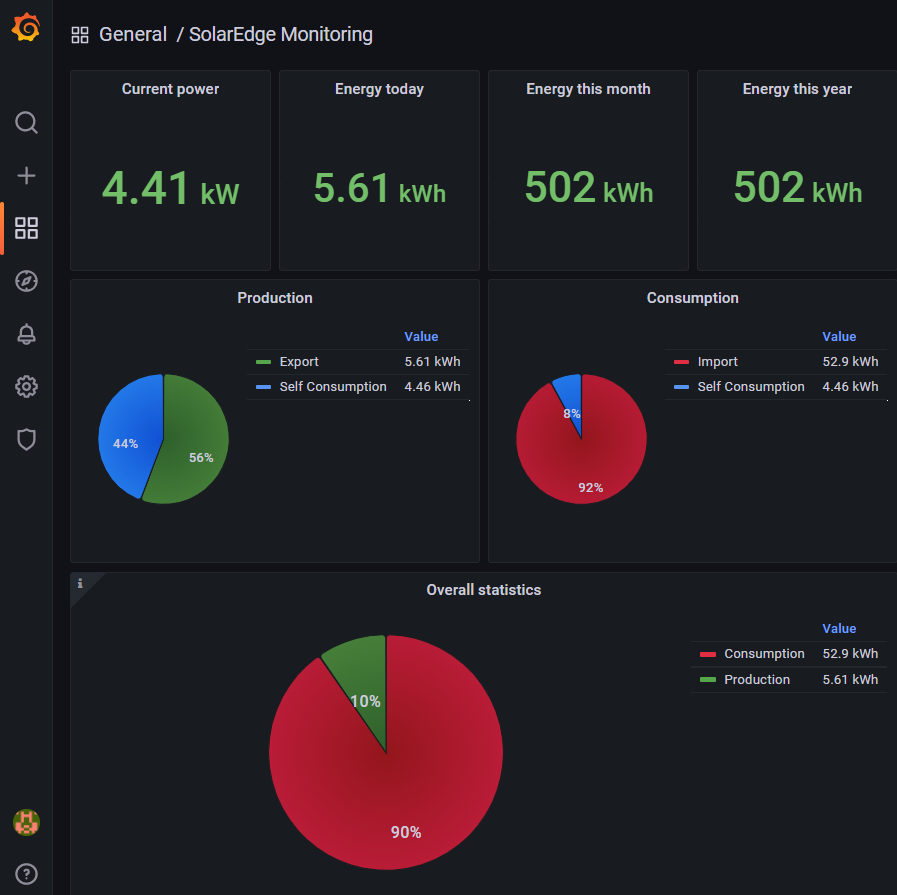
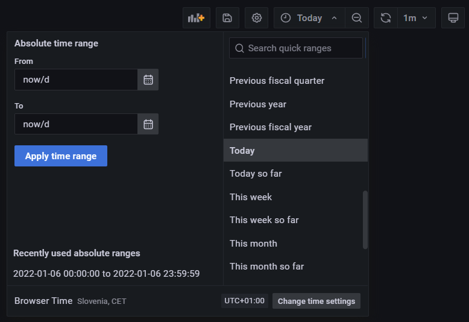

At the end of last year, I had a solar system installed at home. And as a proud owner, I wanted to visualize the most important indicators of the system in a simple way.
For this purpose I've used **[SolarEdge API](https://www.solaredge.com/sites/default/files//se_monitoring_api.pdf)**, **[MySQL](https://www.mysql.com/)** as storage and **[Grafana](https://grafana.com/)** for vusualizing indicators. But let's go step-by-step.

# SolarEdge API Access

The SolarEdge API can be accessed via HTTPS protocol only. SolarEdge monitoring server supports both HTTPS/1.0 and HTTPS/1.1 protocols. All APIs are secured via an access token: **every access to the API requires a valid token** as a URL parameter named **api_key**. For example: **api_key= L4QLVQ1LOKCQX2193VSEICXW61NP6B1O**  
An API key can be generated to enable access to specific sites (via Site API key) or to all sites within a specific account (via Account API key).



# Running in Docker

## Docker-Compose Files
**Docker-compose.yml** file with setup for all the containers looks like this:
```yml
version: '3.9'

services:
  grafana:
    image: grafana/grafana-enterprise
    container_name: solaredge_grafana
    restart: unless-stopped
    volumes:
      - grafana_data:/var/lib/grafana
      - ./datasources:/etc/grafana/provisioning/datasources/
      - ./dashboards:/etc/grafana/provisioning/dashboards/
    labels:
      org.label-schema.group: "Monitoring"    
    networks:
      - common_network
    depends_on: 
      - mysql

  mysql:
    image: mysql
    container_name: solaredge_mysql
    restart: always
    volumes:
      - mysql_data:/var/lib/mysql
      - ./scripts/initdata.sql:/docker-entrypoint-initdb.d/2.sql
    labels:
      org.label-schema.group: "Database"
    networks:
      - common_network
    healthcheck:
      test: ["CMD", "mysqladmin" ,"ping", "-h", "localhost"]
      timeout: 20s
      retries: 10

  solaredge.monitoring.demo:
    container_name: solaredge_openapi
    image: solaredgemonitoringdemo:latest
    restart: on-failure
    hostname: solaredge.monitoring.demo.openapi
    build:
      context: .
      dockerfile: src/SolarEdge.Monitoring.Demo/Dockerfile
    networks:
      - common_network
    depends_on: 
      mysql:
        condition: service_healthy

volumes:
    mysql_data:
    grafana_data:

networks:
    common_network:
        driver: bridge
```
All you have to do is set your SolarEdge **Site Id** (MY_SITE_ID) and **API key** (MY_API_KEY) in the **docker-compose.override.yml** file.
```yml
version: '3.9'

services:
  solaredge.monitoring.demo:
    environment:
      - ASPNETCORE_ENVIRONMENT=Development
      - ServiceConfig__SolarEdgeSiteId=MY_SITE_ID
      - ServiceConfig__SolarEdgeApiKey=MY_API_KEY
      - ServiceConfig__MySqlConnectionString=server=mysql;user=solar;password=solar;port=3306;database=SolarEdge;
      - ServiceConfig__OverviewJobCronSchedule=0 0/10 8-18 ? * * *
      - ServiceConfig__EnergyDetailsJobCronSchedule=0 0/5 8-18 ? * * *
    ports:
      - 9900:80

  grafana:
    environment:
      - GF_SECURITY_ADMIN_USER=admin
      - GF_SECURITY_ADMIN_PASSWORD=admin
      - GF_USERS_ALLOW_SIGN_UP=false
      - GF_PATHS_LOGS=/var/log/grafana/
      - GF_LOG_MODE=console file
      - GF_LOG_LEVEL=info
      - GF_AUTH_ANONYMOUS_ENABLED=true
      - GF_AUTH_ANONYMOUS_ORG_NAME=SolarEdge Monitoring Demo
      - GF_AUTH_ANONYMOUS_ORG_ROLE=Editor
      - GF_DASHBOARDS_DEFAULT_HOME_DASHBOARD_PATH=/etc/grafana/provisioning/dashboards/SolarEdgeMonitoring.json
    ports:
      - 3000:3000

  mysql:
    environment:
      - MYSQL_DATABASE=SolarEdge
      - MYSQL_USER=solar
      - MYSQL_PASSWORD=solar
      - MYSQL_ROOT_PASSWORD=solar
    ports:
      - 3306:3306
```
# Setup the Containers
To execute compose file, open Powershell, and navigate to the compose file in the root folder. Then execute the following command: **docker-compose up -d --build**. To check all running Containers use **docker ps**.



# Update Energy details/overview data
You can update your energy details/overview data for custom or predefined date ranges with help of **[SolarEdge monitoring OpenAPI service](http://localhost:9900/swagger/index.html)** which is available locally on **http://localhost:9900/swagger/index.html** address:


# Monitoring dashboard

Your data is visualized with **[Grafana](http://localhost:3000)** which is available locally on **http://localhost:3000** address. Enter default user name (admin) and password (admin), skip changing password, and voila, your SolarEdge monitoring dashboard is here:


You can also change the time range and the graphs will be updated accordingly.


Enjoy!

## Prerequisites
- [Visual Studio](https://www.visualstudio.com/vs/community) 2022 17.2.6 or greater
- [.NET SDK 8.0](https://dotnet.microsoft.com/download/dotnet/8.0)
- [Docker](https://www.docker.com/resources/what-container)

## Tags & Technologies
- [.NET 8](https://github.com/dotnet/core/blob/main/release-notes/8.0)
- [Docker](https://www.docker.com/resources/what-container)  
- [SolarEdge Monitoring Server API](https://www.solaredge.com/sites/default/files//se_monitoring_api.pdf)
- [MySQL](https://www.mysql.com/)
- [Grafana](https://grafana.com/)

## Licence
Licenced under [MIT](http://opensource.org/licenses/mit-license.php).
Contact me on [LinkedIn](https://si.linkedin.com/in/matjazbravc).

SOLAREDGE is a trademark and brand of [SolarEdge](https://www.solaredge.com/) Technologies Ltd.
